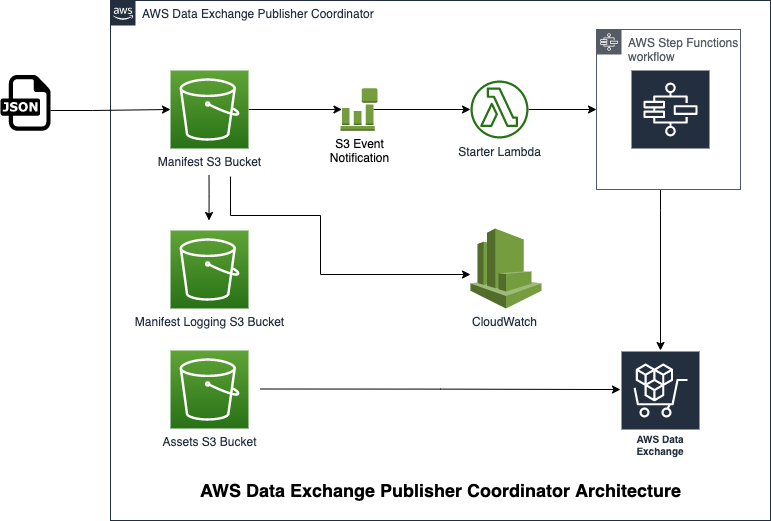

<a href="https://www.rearc.io/data/">
    
</a>

## AWS Data Exchange Publisher Coordinator

This package sets up AWS Step Functions Workflow to automatically execute the publication steps for new dataset revisions for AWS Data Exchange Products. Execution is triggered when a manifest file for a new revision is uploaded to this S3 bucket.

This package offers several improvements over the [aws-data-exchange-publisher-coordinator](https://github.com/awslabs/aws-data-exchange-publisher-coordinator) to address various [quota limits](https://docs.aws.amazon.com/data-exchange/latest/userguide/limits.html) of Amazon Data Exchange and improves logging. Main limits which were a pain point for the Rearc Data Team are addressed in this solution as follows:
- Support for an arbitrary number of assets in each update: 
    - ADX has a limit of 10k assets per revision
    - ADX dataset import jobs have a limit of 100 assets per import job and a maximum of 10 concurrent import jobs

### Usage
Below is the architecture diagram of this project:
<br/><br/>

<br/><br/>
You should have the following prerequisites in place before running the code:
1. An AWS Data Exchange product and dataset
2. Three existing S3 buckets: 
    * AssetBucket: For uploading the assets
    * ManifestBucketLoggingBucket: For logging activities
    * DistributionBucket: For uploading the Lambda code
3. Python 3.8+
4. AWS CLI
5. AWS SAM CLI

Once you have all prerequisites in place, clone the repository and update the code:
1. Update the `Parameters` section of the `source/template.yaml` CloudFormation template with the names of the four S3 buckets: The three pre-existing buckets you created above and a `ManifestBucket` name which will be created by Cloudformation. 

```
Parameters:
  ManifestBucket:
    Type: String
    Default: 'my-test-manifest-bucket' // Name of the new bucket that will be created in this solution
    Description: S3 Bucket name where .manifest files will be stored
  AssetBucket:
    Type: String
    Default: 'my-asset-bucket-publisher-test' // Name of the existing bucket where new assets are added 
    Description: Bucket containing assets and referenced in the manifest.  
  ManifestBucketLoggingBucket:
    Type: String
    Default: 'my-test-manifest-logging-bucket' // Name of the existing bucket where activity logs will be saved
    Description: Bucket to store server access logs associated with the manifest bucket
  ManifestBucketLoggingPrefix:
    Type: String
    Default: 'my-publisher-coordinator-logs/' // Prefix string (including the trailing slash)
    Description: Prefix location for server access logs associated with the manifest bucket
```

2. Update the `run.sh` file with the names of the following variables:
```
export CFN_CODE_BUCKET=my-bucket-name # bucket where customized code will reside
export SOLUTION_NAME=my-solution-name # name of the CloudFormation stack
export VERSION=my-version # version number for the customized code
```

`run.sh` creates a `local` directory, replaces the names you specified in the Cloudformation template, packages the Lambda codes as zip files, uploads the code to the `$CFN_CODE_BUCKET` S3 bucket in your account using the AWS CLI, and finally builds and deploys the Cloudformation template using the AWS SAM CLI.

3. From the root directory of the project, run `run.sh`:
```
chmod +x run.sh
./run.sh
```

### The Manifest File
Any time a manifest file is uploaded to the `ManifestBucket`, a Step Function execution pipeline is trigerred. The manifest file should follow a specific format:
- The of the manifest file should end with `.json`
- The file should include a `JSON` object with the following format:
```
{
  "product_id": <PRODUCT_ID>,
  "dataset_id": <DATASET_ID>,
  "asset_list": [
    { "Bucket": <S3_BUCKET_NAME>, "Key": <S3_OBJECT_KEY> },
    { "Bucket": <S3_BUCKET_NAME>, "Key": <S3_OBJECT_KEY> },
    ...
  ]
}
```


### Contact Details
- If you find any issues with or have enhancement ideas for this product, open up a GitHub [issue](https://github.com/rearc-data/aws-data-exchange-publisher-coordinator/issues) and we will gladly take a look at it. Better yet, submit a pull request. Any contributions you make are greatly appreciated :heart:.
- If you have any questions or feedback, send us an email at data@rearc.io.

### About Rearc
Rearc is a cloud, software and services company. We believe that empowering engineers drives innovation. Cloud-native architectures, modern software and data practices, and the ability to safely experiment can enable engineers to realize their full potential. We have partnered with several enterprises and startups to help them achieve agility. Our approach is simple — empower engineers with the best tools possible to make an impact within their industry.
